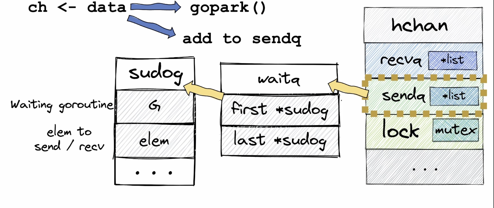

# Header
```go
type hchan struct {
	qcount   uint           // total data in the queue
	dataqsiz uint           // size of the circular queue
	buf      unsafe.Pointer // points to an array of dataqsiz elements
	elemsize uint16
	closed   uint32 // because of atomics, it must be uint32
	timer    *timer // timer feeding this chan
	elemtype *_type // element type
	sendx    uint   // send index
	recvx    uint   // receive index
	recvq    waitq  // linked-list of recv waiters(goroutines)
	sendq    waitq  // linked-list of send waiters(goroutines)

	// lock protects all fields in hchan, as well as several
	// fields in sudogs blocked on this channel.
	//
	// Do not change another G's status while holding this lock
	// (in particular, do not ready a G), as this can deadlock
	// with stack shrinking.
	lock mutex
}
```
- `closed` имеет тип uint32, так как [atomic](../4.2%20atomic.md) операции возможны только с 32битными переменными.
- `make(chan T)` возвращает указатель на hchan
# Свойства
1. goroutine-safe (потокобезопасность)
2. FIFO (очередь)
3. Аллоцируется на heap
4. передача данных между горутинами
5. блокировка горутин
# API
1. Создание: `ch := make(chan int, size)` 
2. Запись: `ch <- 1` 
3. Чтение: 
	1. Единоразовое: `val, opened := <-ch`
	2. В цикле: `for val := range ch`
4. Закрытие: `close(ch)`
5. Заполненность буфера: `len(ch)`
6. Вместимость буфера: `cap(ch)`
## Чтение
При чтении из канала можно получить 2 переменные:
1. Значение `val`
2. Флаг состояния `opened` - открыт или закрыт канал
```go
val, opened := <-ch
```
При чтении из закрытого канала будем получать [zero value](../1.3%20zero%20value.md) для типа канала.

Чтение через `for range` возвращает только значение. Флаг состояния будет проверяться автоматически. Цикл завершится **ТОЛЬКО ТОГДА**, когда канал будет **ЗАКРЫТ**. 
Если не закрыть канал и чтение в отдельное горутине заблокируется - будет [утечка горутины](goroutine.md##1%20variant)
```go
for val := range ch{
	//...
}
```
## Закрытие
- Все **слушатели** получат уведомление (разблокируются, из recvq). Флаг `opened` будет равен `false`
- Все **писататели** тоже разблокируются (из sendq), но сразу же попробуют записать значение в канал, что вызовет [панику](../2.1%20panic%20и%20recover.md#panic>):
```go
package main
import "time"
func main() {
	ch := make(chan int)
	go func() {
		ch <- 1 // will panic after close
	}()

	time.Sleep(1 * time.Second)
	close(ch) 
	time.Sleep(1 * time.Second)
}
```
- При повторном закрытии закрытого канала будет [паника](<2.1 panic и recover.md#panic>).

# Операции над каналами

|           | nil chan | closed chan                            |
| --------- | -------- | -------------------------------------- |
| **close** | panic    | panic                                  |
| **read**  | block    | [zero value](../1.3%20zero%20value.md) |
| **write** | block    | panic                                  |
# Проверка канала перед записью
Написать как можно проверить канал (закрыт ли) перед отправкой.
# Зачем нужны nil-каналы?
Почему чтение и запись в nil chan не приводит к [panic](../2.1%20panic%20и%20recover.md#panic)?

Функция `WaitToClose` завершится только когда закроются два канала - `lhs & rhs`.
В [select](select.md) читаются 2 канала. Даже если закрыть их - чтение из будет возвращать [zero value](../1.3%20zero%20value.md) и блокировки не будет. Мы будем проваливаться в case недетерминированно. 

По свойству [select](select.md), он выбирает неблокирующие ветки. Поэтому можно присвоить каналу [nil](../types/nil.md) значение и тогда мы больше не провалимся в case, который читает из него. Потому что чтение из nil канала - блокирующая операция.
```go
package main

import (
	"fmt"
	"sync"
)

func WaitToClose(lhs, rhs chan struct{}) {
	lhsClosed, rhsClosed := false, false
	for !lhsClosed || !rhsClosed {
		select {
		case _, ok := <-lhs:     // not blocking operation
			fmt.Println("lhs", ok)
			if !ok {
				lhsClosed = true
				// lhs = nil     // add this to fix
			}
		case _, ok := <-rhs:
			fmt.Println("rhs", ok)
			if !ok {
				rhsClosed = true
				// rhs = nil      // add this to fix
			}
		}
	}
}

func main() {
	lhs := make(chan struct{}, 1)
	rhs := make(chan struct{}, 1)

	wg := sync.WaitGroup{}
	wg.Add(1)

	go func() {
		defer wg.Done()
		WaitToClose(lhs, rhs)
	}()

	lhs <- struct{}{}
	rhs <- struct{}{}

	close(lhs)
	close(rhs)

	wg.Wait()
}
```

# Чтение из нескольких каналов
[select](select.md)
# Unbuffered chan (synchronous)
```go
c := make(chan string)
```
- Нет буфера
- [goroutine](goroutine.md) блокируется при записи/чтении, пока другая не прочитает/запишет данные
- Если горутина будет читать/писать в небуф. канал, с которым больше никто не работает - будет **deadlock**.
- Данные передаются путем передачи данных из стека отправителя в стек читателя через функцию sendDirect.
## possible deadlock
```go
package main

import (
	"fmt"
)

type e struct {
	key *string
}

func (e e) String() {}

type i interface {
	String()
}

var eventChan = make(chan i, 100)

// ---------------------------------
type proc struct {
	m        map[string]string
	doneChan chan struct{}
}

func newProc() *proc {
	return &proc{
		m:        make(map[string]string),
		doneChan: make(chan struct{}), // 1. unbuffered chan
	}
}

func (p *proc) addEntry(k, v string) {
	p.m[k] = v
}

func (p *proc) run() {
	go func() {
		defer func() {
			p.doneChan <- struct{}{} // 4. lock forever - 1 goroutine not sleeping, so no possible deadlock for compiler
		}()

		p.addEntry("a", "1")
		p.addEntry("b", "2")

		for event := range eventChan {
			if _, ok := p.m[*event.(e).key]; ok { //3 . nil pointer deref - panic
				fmt.Println("OK")
			}
		}
	}()
}

func main() {
	p := newProc()
	p.run()
	defer func() {
		<-p.doneChan
	}()

	go func() {
		eventChan <- e{} //2. no key present - nil pointer

		for {
		}
	}()

	select {}
}
```
# Buffered chan (asynchronous)
```go
c := make(chan string, 5) //can contain up to 5 elements
```
## Circular buffer
- Буферизированный канал имеет очередь для данных - `массив длины dataqsiz`.
- Два указателя - на следующий индекс для записи (`sendx`)  и чтения(`recvx`).
- Когда один из указателей доходит до последнего индекса, то обнуляется.
## Алгоритм использования
1. Отправитель 
	1. Блокируется мьютекс внутри канала 
	2. Данные копируются в канал
	3. Разблокирует мьютекс
2. Читатель
	1. Блокируется мьютекс
	2. Данные копируются в [Стек горутины](../memory%20model/Стек%20горутины.md) или кучу
	3. Разблокируется мьютекс
## Buffer overflow
При переполнении канала(или нулевом буфере), горутина ставится на паузу при отправке в канал или чтении из канала. 
1. Вызвается функция [gopark](https://go.dev/src/runtime/HACKING#synchronization) [Source code](https://go.dev/src/runtime/proc.go#:~:text=443-,func%20gopark,-(unlockf%20func(*g) Она меняет состояние горутины из Running -> Waiting.
2. Горутина снимается с этого треда, помещается в sendq канала. На её место ставится другая из runqueue.

## sendq & recvq
Представляют собой ссылку на структуру waitq - связного списка, которая хранит ссылки на первый и последний элементы. Эти элементы представляют собой структуру [sudog](https://github.com/golang/go/blob/36bca3166e18db52687a4d91ead3f98ffe6d00b8/src/runtime/runtime2.go#L406C1-L406C20). В ней хранится:
1. Спящая горутина
2. Указатель на элемент, который нам нужно отправить, если спящая - отправитель.
3. Указатель на ячейку памяти, куда нужно положить элемент, если спящая - получатель.
## пробуждение спящего отправителя
Когда в канале появляется свободное место - получатель смотрит в sendq на наличие спящих горутин. Если такие есть - он положит её элемент в буфер и пробудит горутину:
1. Вызывается goready(), которая меняет статус с Waiting -> Runnable
2. Пробужденная горутина попадает в runqueue(у планировщика), когда появится свободный thread - она продолжит свое выполнение
## пробуждение спящего получателя
Если получатель пытается прочитать из пустого канала - он засыпает и попадает в очередь `recvq`. Когда приходит отправитель, он проверяет очередь, и если он нашел получателя - копирует данные из своего стека в другой через функцию sendDirect.
# Difference
Канал не буферизован. Запись заблокирована до момента чтения.
```go
var c = make(chan int) // <--- UNBUFFERED
var a string

func f() {
 a = "hello, world"
 <-c
}

func main() {
 go f()
 c <- 0
 print(a)
}
```

Если бы канал был буферизован, программа не гарантированно вывела бы «hello, world». (Она могла бы вывести пустую строку, завершить работу или сделать что-то ещё.)

```go
var c = make(chan int, 1) // <--- BUFFERED
var a string

func f() {
 a = "hello, world"
 <-c
}

func main() {
 go f()
 c <- 0
 print(a)
}
```
# Patterns
## Simple semaphore
```go
var limit = make(chan int, 3)

func main() {
	for _, w := range work {
		go func(w func()) {
			limit <- 1
			w()
			<-limit
		}(w)
	}
	select{}
}
```
## Generator
Функция создает и сразу возвращает канал. Под капотом она создает [горутину](goroutine.md), которая будет писать в этот канал до какого-то момента, а потом закроет канал:
```go
func generator(n int) chan int{
	ch := make(chan)
	go func(){
		defer close(ch)
		
		for i := range n{
			ch <- i
		}
	}()
	
	return ch
}
```
## Pipeline
Используя Генераторы, можно строить пайплайны:
```go
package main

func generator(n int) chan int {
	out := make(chan int)
	go func() {
		defer close(out)

		for i := range n {
			out <- i
		}
	}()

	return out
}

func multSelf(in chan int) chan int {
	out := make(chan int)
	go func() {
		defer close(out)
		for val := range in {
			out <- val * val
		}
	}()

	return out
}

func filterEven(in chan int) chan int {
	out := make(chan int)
	go func() {
		defer close(out)
		for val := range in {
			if val&1 == 0 {
				out <- val
			}
		}
	}()

	return out
}

func main() {
	for val := range filterEven(multSelf(generator(10))) {
		println(val)
	}
}
```